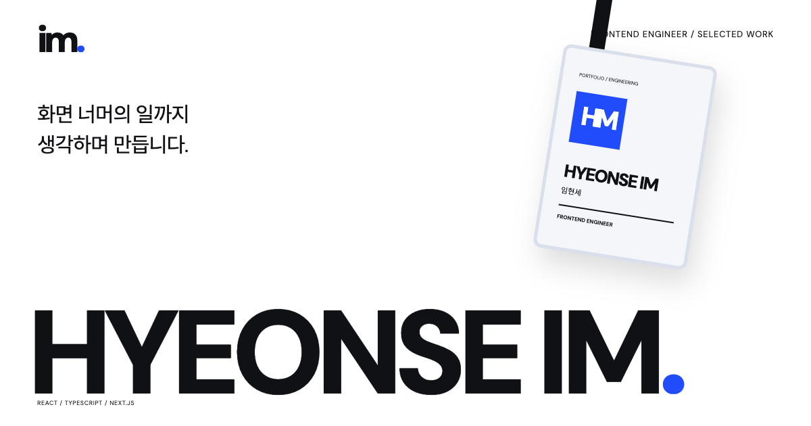

# Hyeonse Im · Portfolio

고객 웹·웹뷰와 운영 도구를 만드는 프론트엔드 엔지니어 임현세의 포트폴리오입니다. SWING, SWAP, Yellow Bus에서 맡은 작업과 기술적 선택, 검증 과정을 한국어와 영어로 정리했습니다.

[포트폴리오 보기](https://hyeonse-portfolio.vercel.app/) · [English](https://hyeonse-portfolio.vercel.app/en/) · [LinkedIn](https://www.linkedin.com/in/hyeonse-im-131b54141/)

[](https://hyeonse-portfolio.vercel.app/)

## 대표 사례

각 사례에서 업무 맥락과 제 역할, 구현 과정, 확인한 결과와 한계를 설명합니다.

| 프로젝트 | 주요 내용 |
| --- | --- |
| [바이크 주문·계약 운영 화면](https://hyeonse-portfolio.vercel.app/work/bike-operations/) | 직원용 주문·계약 업무와 사업자 조회 흐름 |
| [SWING 웹 성능 개선](https://hyeonse-portfolio.vercel.app/work/swing-home-performance/) | 첫 화면 렌더링과 미디어·폰트 전송량 개선 |
| [Yellow Bus 운행 도구](https://hyeonse-portfolio.vercel.app/work/yellow-bus/) | 흩어져 있던 배차·탑승·노선 관리 기능 재구성 |
| [SWAP Admin V1·V2 전환](https://hyeonse-portfolio.vercel.app/work/swap-admin-v2/) | 기존 작업 데이터가 공존하는 환경에서 화면·API 전환 참여 |

프로젝트 도식은 업무 흐름을 설명하기 위해 재구성했습니다. 회사 소스 코드, 비공개 제품 화면과 고객 데이터는 포함하지 않습니다. 사례 속 성능 수치는 해당 프로젝트의 로컬 측정 결과이며, 측정 조건은 사례 본문에 함께 적었습니다.

## 사이트 구현

- 한국어와 영어가 같은 화면 구조를 공유하며, 언어를 바꿔도 보고 있던 페이지로 이동합니다.
- 데스크톱의 ID 배지는 포인터와 키보드로 움직일 수 있습니다. 모바일에서는 정적인 배지를 표시합니다.
- 작업실에서 테마, 강조색, 간격, 모서리와 움직임을 바꿀 수 있습니다. 설정은 브라우저에 저장하고, 기기의 움직임 줄이기 설정을 반영합니다.
- 페이지를 정적 HTML로 내보냅니다. 본문과 기본 언어 링크는 JavaScript 없이도 이용할 수 있습니다.

| 영역 | 사용 기술 |
| --- | --- |
| 화면과 정적 출력 | Next.js 16 · React 19 · TypeScript |
| 스타일 | CSS Modules · CSS custom properties |
| 배지 인터랙션 | Rapier 3D · Three.js · DOM/SVG |
| 글꼴 | 자체 호스팅 DM Sans · Noto Sans KR 서브셋 |
| 호스팅 | Vercel |

## 로컬 실행

Node.js 22 이상이 필요합니다. 저장소 루트에서 실행합니다.

```sh
npm ci
NEXT_TELEMETRY_DISABLED=1 npm run dev -- --port 4321
```

개발 서버는 `http://127.0.0.1:4321`에서 확인할 수 있습니다.

```sh
npm run check
NEXT_TELEMETRY_DISABLED=1 npm run build
npm run audit:content
npm run preview -- 4322
```

`check`는 TypeScript, `audit:content`는 공개 콘텐츠·내부 링크·글꼴 문자 범위를 검사합니다. 빌드 결과는 `out/`에 생성하며, `preview`로 `http://127.0.0.1:4322`에서 확인합니다. 서버는 Ctrl+C로 종료합니다.

## 코드 살펴보기

| 경로 | 내용 |
| --- | --- |
| `src/app/` | 한국어·영어 페이지 라우트와 메타데이터 |
| `src/components/` | 홈, 소개, 사례, 작업실과 배지 UI |
| `src/data/` · `src/data/en/` | 언어별 경력·프로젝트·화면 문구 |
| `src/lib/` | 언어 경로, 화면 설정, 배지 물리 계산 |
| `src/styles/` | 공통 스타일과 디자인 토큰 |
| `scripts/` | 정적 미리보기, 콘텐츠 검사, 글꼴 서브셋 생성 |

자세한 내용은 [개발 안내](docs/development.md)와 [디자인 시스템](DESIGN_SYSTEM.md)에 정리했습니다. 글꼴 라이선스는 [DM Sans](public/fonts/DM-Sans-LICENSE.txt), [Noto Sans KR](public/fonts/Noto-Sans-KR-LICENSE.txt)에서 확인할 수 있습니다.
